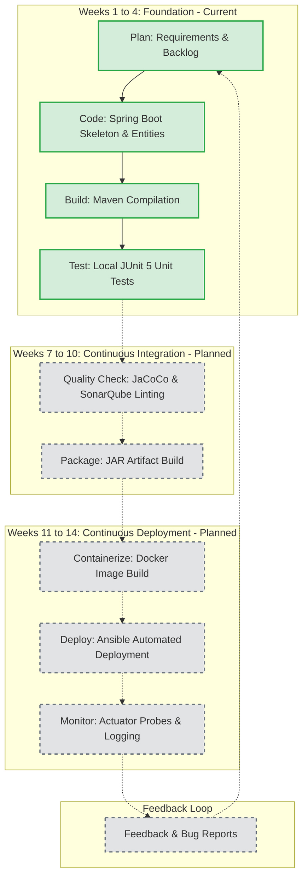

# Week 2: Agile Planning and DevOps Lifecycle Plan

**Project Title:** Jenkins-Based Food Delivery Partner Portal  
**Document Version:** 1.0.0  
**Status:** Approved Baseline  

---

## 1. Product Vision

> *To deliver a secure, auditable, and high-performance operational portal that streamlines the end-to-end lifecycle of food delivery partners—from initial onboarding and strict state-machine compliance to operational dashboarding—backed by an automated, zero-downtime DevOps delivery pipeline.*

---

## 2. User Personas

### Persona 1: System Administrator (Alex Mercer)
* **Demographics:** Senior IT Systems & Security Administrator, 34 years old.
* **Goals:** Maintain zero-trust access control, monitor application uptime and health metrics, ensure automated CI/CD pipeline stability, and review security audit logs.
* **Pain Points:** Unaudited privilege escalation, manual configuration errors during deployments, lack of centralized health observability.
* **Key Needs:** Granular Role-Based Access Control (RBAC), immutable audit logging, Spring Actuator health metrics, and automated containerized delivery.

### Persona 2: Operations Manager (Priya Sharma)
* **Demographics:** Regional Delivery Operations Manager, 29 years old.
* **Goals:** Monitor fleet availability across zones, review partner onboarding applications, enforce disciplinary suspension/reactivation policies, and track fleet statistics.
* **Pain Points:** Inconsistent partner statuses, unvetted drivers becoming active, lack of aggregated summary metrics, and slow partner record lookup.
* **Key Needs:** Intuitive partner search by multi-attribute filters, strict status transition validation, and real-time dashboard counters.

### Persona 3: Delivery Partner / Applicant (Rahul Verma)
* **Demographics:** Full-time Courier Partner, 25 years old.
* **Goals:** Submit onboarding profile information, register vehicle credentials, and receive clear operational status updates.
* **Pain Points:** Lack of clarity on application verification stage, profile data mismatches.
* **Key Needs:** Standardized profile record creation, unique identifier tracking, and transparent verification lifecycle.

---

## 3. Epics Breakdown

1. **EPIC-01: Partner Profile Management** — Core CRUD operations for driver records, vehicle registration, and contact information.
2. **EPIC-02: Partner Search & Filtering** — Sub-second multi-criteria querying (by name, phone, email, status, vehicle type) with pagination.
3. **EPIC-03: Partner Status & Lifecycle Workflow** — State-machine governance for partner status transitions with strict role validation.
4. **EPIC-04: Audit Logging & History Tracking** — Immutable historical capture of status transitions and sensitive profile changes.
5. **EPIC-05: Operational Dashboard & Reporting** — Real-time aggregation of fleet status counters and performance summaries.
6. **EPIC-06: Authentication & Role-Based Authorization** — Secure endpoint access with predefined user roles (ADMIN, OPS_MANAGER, SUPPORT).
7. **EPIC-07: Automated Testing Suite** — Unit, integration, slice, and end-to-end regression test suites.
8. **EPIC-08: Continuous Integration (CI) with Jenkins** — Automated code checkout, compilation, unit testing, and quality scanning.
9. **EPIC-09: Containerization & Continuous Deployment (CD)** — Docker image packaging, versioned artifact registry, and automated server deployment.
10. **EPIC-10: Configuration Management & Infrastructure Automation** — Ansible playbooks for server provisioning, health monitoring, and rollback strategies.

---

## 4. User Stories & Acceptance Criteria

### User Story 1: Create Delivery Partner Record (EPIC-01)
> **As an** Operations Support Agent,  
> **I want to** register a new delivery partner with their personal details, contact info, and vehicle type,  
> **So that** their profile enters the verification pipeline.

* **Acceptance Criteria (Gherkin):**
  * **Given** valid partner payload (full name, valid email, 10-digit phone, valid vehicle type, license number),
  * **When** the `POST /api/v1/partners` endpoint is called,
  * **Then** a `201 Created` status is returned with the generated UUID partner record,
  * **And** the partner's initial status is automatically initialized to `PENDING`,
  * **And** a corresponding `StatusHistory` and `AuditLog` entry is created.
  * **Given** an invalid payload (e.g. duplicate email/phone or missing required fields),
  * **When** submitted,
  * **Then** a `400 Bad Request` is returned with detailed field-level validation errors.

### User Story 2: Search Delivery Partners (EPIC-02)
> **As an** Operations Manager,  
> **I want to** search delivery partners by name, phone number, vehicle type, or status with pagination,  
> **So that** I can rapidly locate driver records during daily operations.

* **Acceptance Criteria (Gherkin):**
  * **Given** search query parameters (`name`, `phone`, `status`, `vehicleType`, `page`, `size`),
  * **When** `GET /api/v1/partners/search` is executed,
  * **Then** matching partners are returned inside a paginated response payload with metadata (`totalElements`, `totalPages`, `currentPage`),
  * **And** if no matches exist, an empty list with `200 OK` is returned,
  * **And** response latency remains under 200ms for indexed fields.

### User Story 3: Transition Partner Lifecycle Status (EPIC-03)
> **As an** Operations Manager,  
> **I want to** update the status of a delivery partner (e.g., from `PENDING` to `VERIFICATION` or `ACTIVE`),  
> **So that** only validated drivers are activated for dispatch.

* **Acceptance Criteria (Gherkin):**
  * **Given** a partner in `PENDING` status and an authorized `OPS_MANAGER` or `ADMIN`,
  * **When** `PATCH /api/v1/partners/{id}/status` is called with target status `VERIFICATION` and a reason,
  * **Then** the status updates successfully, returning `200 OK`,
  * **And** the transition is recorded in `status_history`.
  * **Given** an invalid transition (e.g., `PENDING` $\to$ `DEACTIVATED` directly),
  * **When** requested,
  * **Then** the system rejects the operation with `422 Unprocessable Entity` or `400 Bad Request` and descriptive error message.

### User Story 4: View Operations Summary Dashboard (EPIC-05)
> **As an** Operations Manager,  
> **I want to** view aggregate statistics of the fleet,  
> **So that** I can assess driver capacity and pending verification backlogs.

* **Acceptance Criteria (Gherkin):**
  * **Given** an authenticated user with read permissions,
  * **When** `GET /api/v1/dashboard/summary` is requested,
  * **Then** the response includes `totalPartners`, `activePartners`, `pendingVerificationCount`, `suspendedCount`, and `deactivatedCount`,
  * **And** data reflects real-time database state.

### User Story 5: Application Health & Metrics (EPIC-08)
> **As a** DevOps Engineer,  
> **I want** the application to expose automated liveness and readiness health probes,  
> **So that** monitoring tools and CI/CD deployment gates can verify system availability.

* **Acceptance Criteria (Gherkin):**
  * **Given** a running Spring Boot instance with a healthy PostgreSQL connection,
  * **When** `GET /actuator/health` is requested,
  * **Then** `{"status": "UP"}` with HTTP 200 is returned.

---

## 5. Prioritized Product Backlog

| ID | Epic | User Story Description | Priority | Story Points | Acceptance Criteria Defined | Target Week | Status |
|---|---|---|---|---|---|---|---|
| **PB-01** | Architecture | Initialize Spring Boot project skeleton & layered architecture | P0 | 3 | Yes | Week 3–4 | Completed |
| **PB-02** | Database | Configure PostgreSQL persistence, JPA entities & schema | P0 | 3 | Yes | Week 3–4 | Completed |
| **PB-03** | Observability | Configure Spring Boot Actuator health endpoint & OpenAPI | P0 | 2 | Yes | Week 3–4 | Completed |
| **PB-04** | Partner Mgmt | Implement Partner CRUD REST endpoints with Validation | P0 | 5 | Yes | Week 5 | Planned |
| **PB-05** | Search | Implement multi-attribute Partner Search & Pagination | P1 | 5 | Yes | Week 5 | Planned |
| **PB-06** | Workflow | Implement State Machine status transitions with Audit Trail | P0 | 5 | Yes | Week 6 | Planned |
| **PB-07** | Dashboard | Implement Dashboard Summary Aggregation endpoint | P1 | 3 | Yes | Week 6 | Planned |
| **PB-08** | Security | Implement Spring Security & Role-Based Access Control | P1 | 5 | Yes | Week 6 | Planned |
| **PB-09** | CI/CD | Configure Jenkinsfile Declarative Pipeline for automated builds | P0 | 5 | Yes | Week 7–8 | Planned |
| **PB-10** | Testing | Implement automated Selenium / UI / integration test suite | P1 | 5 | Yes | Week 9–10 | Planned |
| **PB-11** | Containerization | Build multi-stage Dockerfile and Docker Compose environment | P0 | 5 | Yes | Week 11–12 | Planned |
| **PB-12** | Infra Automation | Create Ansible Playbooks for server provisioning & rollback | P1 | 5 | Yes | Week 13–14 | Planned |
| **PB-13** | Release | Final Release packaging, comprehensive documentation & viva demo | P0 | 3 | Yes | Week 15 | Planned |

*Priority Legend: **P0** (Critical / MVP Core), **P1** (High), **P2** (Medium), **P3** (Low / Future Enhancement)*

---

## 6. High-Level 15-Week Project Roadmap

```
Weeks 1–4: Foundation & Architecture (CURRENT PHASE)
  ├── Week 1: Problem definition, stakeholder matrix, MVP scope freeze
  ├── Week 2: Agile backlog, user stories, DevOps lifecycle mapping
  ├── Week 3: Requirements specification, layered architecture, Spring Boot setup
  └── Week 4: Git workflow, branching strategy, GitHub templates & initial commit baseline

Weeks 5–6: Core MVP Feature Implementation
  ├── Week 5: Partner CRUD, data validation, PostgreSQL integration & search
  └── Week 6: State machine workflow, audit history, dashboard summary & basic security

Weeks 7–8: Jenkins Continuous Integration & Delivery
  ├── Week 7: Jenkins installation, webhook configuration & build triggers
  └── Week 8: Declarative Jenkins pipeline (checkout, compile, test, package)

Weeks 9–10: Automated & Continuous Testing
  ├── Week 9: Integration testing and Selenium UI automation
  └── Week 10: Code coverage thresholds (JaCoCo) and automated regression gates

Weeks 11–12: Containerization & Docker CD
  ├── Week 11: Multi-stage Dockerfile creation and local container testing
  └── Week 12: Jenkins pipeline container build, image tagging & containerized deployment

Weeks 13–14: Infrastructure Automation & Reliability
  ├── Week 13: Ansible playbooks for environment provisioning & dependency setup
  └── Week 14: Automated zero-downtime deployment, health verification & rollback scripts

Week 15: Final Release & Academic Evaluation
  └── Week 15: End-to-end validation, documentation sign-off, live demo & viva
```

---

## 7. Definition of Done (DoD)

A user story or feature is classified as **Done** only when all of the following criteria are verified:

1. **Code Implementation:** Clean, readable Java code adhering to SOLID principles and project formatting guidelines.
2. **DTO & Validation:** Proper request/response DTO separation with Jakarta validation annotations.
3. **Automated Testing:** Unit tests written using JUnit 5 and Mockito; all tests pass cleanly.
4. **Error Handling:** Exceptions handled through `@RestControllerAdvice` returning structured `ErrorResponse`.
5. **API Documentation:** Endpoints documented with Swagger/OpenAPI annotations.
6. **Code Review:** Code inspected via Git Pull Request without merge conflicts or unaddressed comments.
7. **Build Verification:** Successful local build execution (`mvn clean test`) with zero compiler warnings.
8. **Git Hygiene:** Atomic commits using Conventional Commits format referencing issue IDs.
9. **Acceptance Criteria:** All Given/When/Then acceptance criteria verified and demonstrated.
10. **Zero Secrets:** No credentials, tokens, or environment-specific passwords committed to version control.

---

## 8. DevOps Lifecycle Mapping


