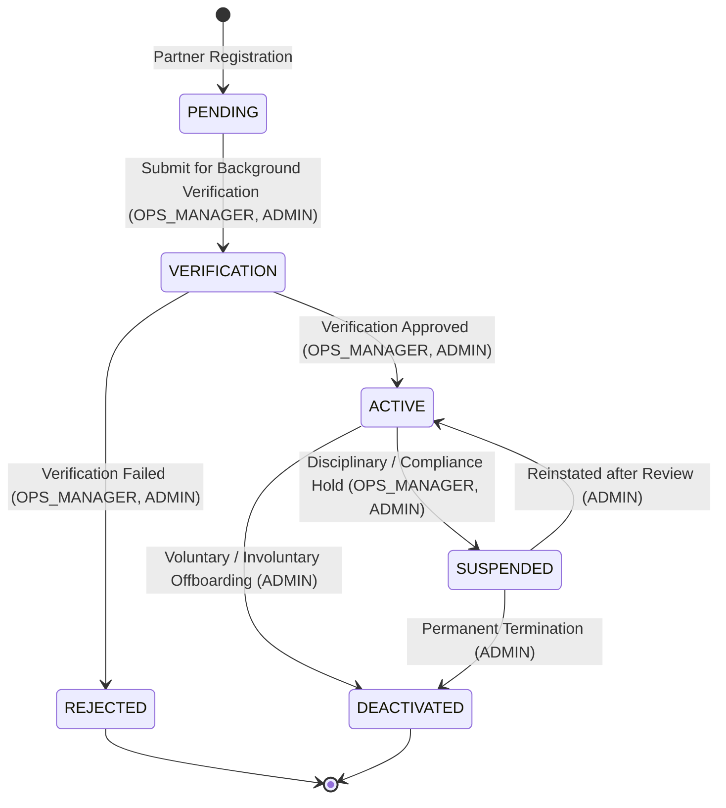
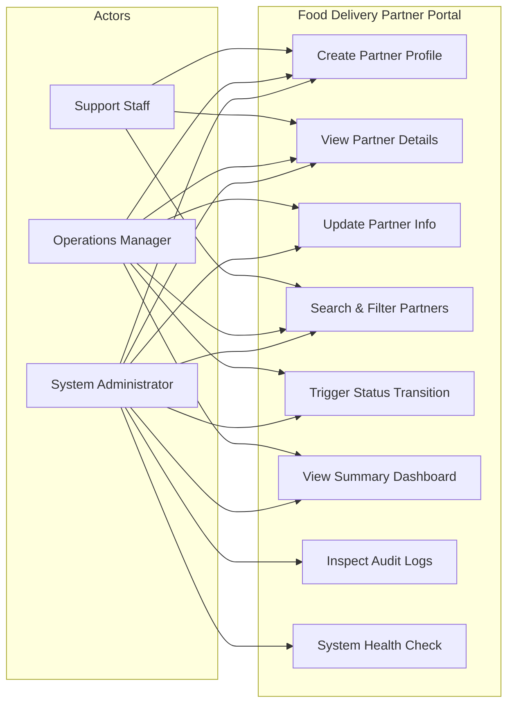
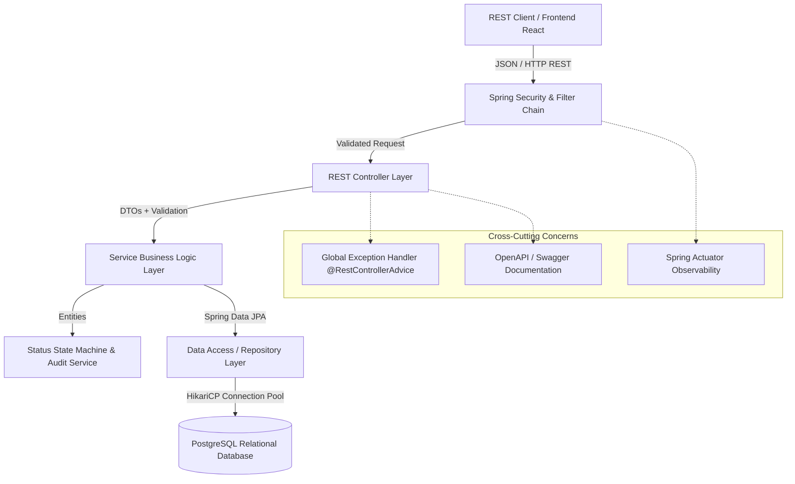
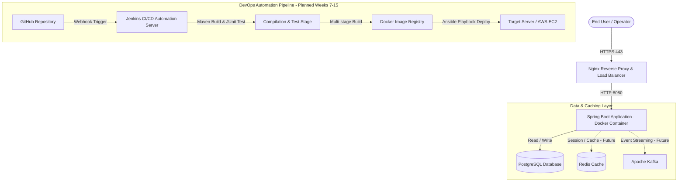
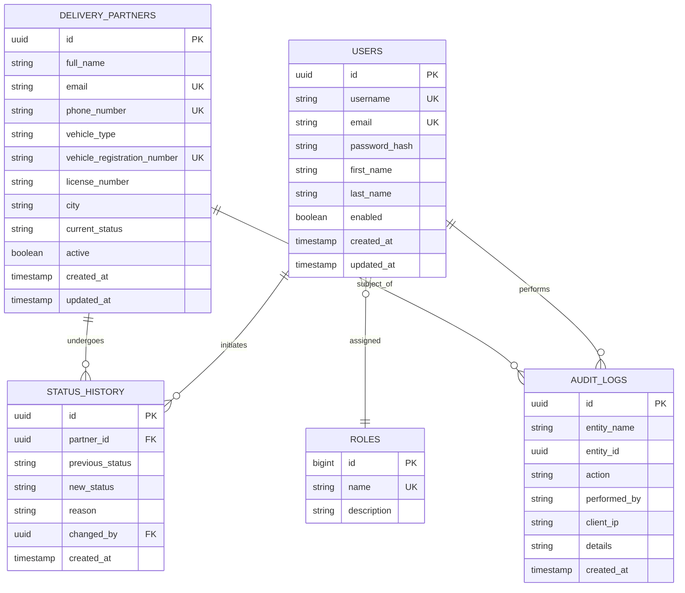

# Week 3: Requirements, System Architecture, and Technology Specifications

**Project Title:** Jenkins-Based Food Delivery Partner Portal  
**Document Version:** 1.0.0  
**Status:** Approved Baseline  

---

## 1. Functional Requirements

### 1.1 Partner Profile Management
* **FR-01 (Create Partner):** The system shall allow authorized operators (`SUPPORT`, `OPS_MANAGER`, `ADMIN`) to create a new delivery partner profile containing: Full Name, Email, Phone Number, Vehicle Type (`BICYCLE`, `MOTORCYCLE`, `SCOOTER`, `CAR`, `VAN`), Vehicle Registration/License Number, and City.
* **FR-02 (Unique Identity):** The system shall enforce global uniqueness on Email, Phone Number, and Vehicle Registration Number.
* **FR-03 (View Partner):** The system shall allow users to retrieve full partner profile details by unique Partner ID (UUID).
* **FR-04 (Update Profile):** The system shall allow updates to non-immutable fields (Phone Number, Vehicle Type, City, Vehicle Registration) while preserving audit logs.
* **FR-05 (Search Partners):** The system shall support filtered searches by name (case-insensitive partial match), phone number, email, vehicle type, and status with pagination (`page`, `size`, `sort`).

### 1.2 Deterministic Partner Lifecycle State Machine
The delivery partner lifecycle is strictly governed by a deterministic Finite State Machine (FSM). Arbitrary status jumps are forbidden.

#### Status Transition Rules Matrix:

| Current Status | Allowed Target Status | Authorized Roles | Business Condition / Trigger |
|---|---|---|---|
| `PENDING` | `VERIFICATION` | `OPS_MANAGER`, `ADMIN` | Initial profile details submitted and preliminary check passes. |
| `PENDING` | `REJECTED` | `OPS_MANAGER`, `ADMIN` | Incomplete or fraudulent documentation submitted. |
| `VERIFICATION` | `ACTIVE` | `OPS_MANAGER`, `ADMIN` | Background check, driving license, and identity verified. |
| `VERIFICATION` | `REJECTED` | `OPS_MANAGER`, `ADMIN` | Background check failed or compliance mismatch. |
| `ACTIVE` | `SUSPENDED` | `OPS_MANAGER`, `ADMIN` | Policy violation, customer safety incident, or pending audit. |
| `SUSPENDED` | `ACTIVE` | `ADMIN` | Disciplinary period served or investigation cleared. |
| `ACTIVE` | `DEACTIVATED` | `ADMIN` | Partner resignation, contract conclusion, or operational phaseout. |
| `SUSPENDED` | `DEACTIVATED` | `ADMIN` | Permanent dismissal following formal disciplinary hearing. |

*Any transition not listed above will be rejected by the backend with HTTP `422 Unprocessable Entity`.*

---

## 2. Dashboard & Reporting Requirements

* **FR-06 (Aggregate Summary Metrics):** The system shall expose a real-time summary dashboard reporting:
  1. `totalPartners`: Total registered partners across all states.
  2. `activePartners`: Count of partners currently in `ACTIVE` status.
  3. `pendingVerificationPartners`: Count of partners awaiting verification (`PENDING` + `VERIFICATION`).
  4. `suspendedPartners`: Count of partners on disciplinary hold (`SUSPENDED`).
  5. `deactivatedPartners`: Count of offboarded partners (`DEACTIVATED`).
  6. `activeFleetPercentage`: Calculated ratio of `(activePartners / totalPartners) * 100`.

---

## 3. Non-Functional Requirements (NFRs)

| NFR Category | Requirement Specification |
|---|---|
| **Security (NFR-01)** | All REST endpoints protected with Spring Security. Role-Based Access Control (RBAC) enforced on sensitive mutations (`ADMIN`, `OPS_MANAGER`, `SUPPORT`). Passwords hashed with BCrypt. Input sanitized against SQL injection and XSS. |
| **Performance (NFR-02)** | Single-record lookups resolve in $< 50\text{ms}$. Paginated search queries across indexed columns resolve in $< 200\text{ms}$ under nominal load ($100\text{ req/sec}$). |
| **Reliability & Consistency (NFR-03)** | ACID transactional consistency across partner status modifications and audit trail creation (`@Transactional`). Zero orphan audit logs. |
| **Maintainability (NFR-04)** | Modular layered Spring Boot structure adhering to SOLID principles. Clear separation between Entities, DTOs, Repositories, Services, and REST Controllers. JaCoCo test coverage target $\ge 80\%$. |
| **Scalability (NFR-05)** | Stateless backend design enabling horizontal scaling behind a reverse proxy/load balancer. Relational indexes on frequently queried fields (`email`, `phone_number`, `status`, `created_at`). |
| **Availability & Health (NFR-06)** | Integration with Spring Boot Actuator exposing standard health (`/actuator/health`), info (`/actuator/info`), and metrics endpoints for automated container orchestrator probes. |
| **Observability & Logging (NFR-07)** | Structured logging via SLF4J / Logback recording all business transitions, actor IDs, client IP addresses, and uncaught exceptions with standardized correlation tracking. |
| **Usability & Documentation (NFR-08)** | Interactive, self-describing REST API documentation provided via OpenAPI 3.0 / Swagger UI (`/swagger-ui.html`). |

---

## 4. Use Case Specifications

---

## 5. Current System Architecture (Weeks 1–4 Baseline)

The application follows an enterprise **3-Tier Layered Architecture** with strict boundaries and dependency inversion:

### Architectural Layer Responsibilities:
1. **Controller Layer (`com.project.partnerportal.controller`):** Handles HTTP requests, parses URI parameters, enforces request schema validation (`@Valid`), delegates to the service layer, and returns standard `ResponseEntity<ApiResponse<T>>`.
2. **Service Layer (`com.project.partnerportal.service`):** Houses pure business logic, coordinates transaction boundaries (`@Transactional`), enforces status state machine rules, and generates audit logs.
3. **Repository Layer (`com.project.partnerportal.repository`):** Extends `JpaRepository` to perform parameterized SQL queries, custom JPQL queries, and pagination with PostgreSQL.
4. **Domain/Entity Layer (`com.project.partnerportal.entity`):** Models relational schema using JPA/Hibernate mappings, entity lifecycle listeners, and validation constraints.
5. **DTO Layer (`com.project.partnerportal.dto`):** Isolates database schemas from public network exposure with dedicated Request and Response DTOs.
6. **Exception & Security Layer (`com.project.partnerportal.exception`):** Centralized error translation providing structured JSON error responses with consistent HTTP status codes.

---

## 6. Future Architecture Evolution (Planned Weeks 7–15)

*Note: Redis, Kafka, Jenkins, Docker, and AWS are future deployment phases and are not required for Weeks 1–4 local development.*

---

## 7. Relational Data Model (ER Diagram)

---

## 8. REST API Specification

### Base URL: `/api/v1`

| HTTP Method | Endpoint Path | Summary / Purpose | Auth Required | Allowed Roles | Request Body | Success Response | Error Codes |
|---|---|---|---|---|---|---|---|
| `GET` | `/actuator/health` | Application health probe | No | Public | None | `200 OK` (Health status) | `503` |
| `POST` | `/api/v1/partners` | Create a new delivery partner | Yes | `SUPPORT`, `OPS_MANAGER`, `ADMIN` | `CreatePartnerRequest` | `201 Created` (`PartnerResponse`) | `400`, `409`, `422` |
| `GET` | `/api/v1/partners` | List all partners (paginated) | Yes | `SUPPORT`, `OPS_MANAGER`, `ADMIN` | None | `200 OK` (`Page<PartnerResponse>`) | `401`, `403` |
| `GET` | `/api/v1/partners/{id}` | Get partner details by ID | Yes | `SUPPORT`, `OPS_MANAGER`, `ADMIN` | None | `200 OK` (`PartnerResponse`) | `404` |
| `PUT` | `/api/v1/partners/{id}` | Update partner profile info | Yes | `OPS_MANAGER`, `ADMIN` | `UpdatePartnerRequest` | `200 OK` (`PartnerResponse`) | `400`, `404`, `409` |
| `GET` | `/api/v1/partners/search` | Search partners with filters | Yes | `SUPPORT`, `OPS_MANAGER`, `ADMIN` | None (Query Params) | `200 OK` (`Page<PartnerResponse>`) | `400` |
| `PATCH` | `/api/v1/partners/{id}/status` | Update partner lifecycle status | Yes | `OPS_MANAGER`, `ADMIN` | `UpdateStatusRequest` | `200 OK` (`PartnerResponse`) | `400`, `404`, `422` |
| `GET` | `/api/v1/partners/{id}/history` | Get partner status transition history | Yes | `OPS_MANAGER`, `ADMIN` | None | `200 OK` (`List<StatusHistoryResponse>`) | `404` |
| `GET` | `/api/v1/dashboard/summary` | Get operational summary counters | Yes | `SUPPORT`, `OPS_MANAGER`, `ADMIN` | None | `200 OK` (`DashboardSummaryResponse`) | `401`, `403` |

---

## 9. Technology Decision Records (TDR)

### TDR 01: Backend Platform — Java 17+ (Java 21 LTS) & Spring Boot 3.x
* **Decision:** Adopt Java LTS with Spring Boot 3.x as the primary backend runtime.
* **Rationale:** Provides strong type safety, mature ecosystem, enterprise-grade dependency injection, built-in validation (Jakarta), out-of-the-box actuator metrics, and seamless integration with Jenkins CI and Docker.
* **Alternatives Considered:** Node.js/Express (less strict type governance for state machines), Python/Django (slower concurrency for high-frequency search/updates).

### TDR 02: Persistence Engine — PostgreSQL
* **Decision:** Use PostgreSQL as the relational database.
* **Rationale:** Full ACID compliance, robust indexing support for multi-field search, native JSON support for audit logs, and industry-standard integration with Spring Data JPA/Hibernate.
* **Alternatives Considered:** MySQL (less strict concurrency isolation defaults), MongoDB (lacks transactional safety required for auditable state transitions).

### TDR 03: Build Tool — Apache Maven
* **Decision:** Standardize on Apache Maven with multi-phase lifecycle plugin management.
* **Rationale:** Declarative XML configuration, standardized directory structure, reliable dependency resolution, and native plugin support in Jenkins CI pipelines.
* **Alternatives Considered:** Gradle (more complex DSL syntax for academic evaluation).

### TDR 04: API Documentation — OpenAPI 3.0 (Springdoc-OpenAPI)
* **Decision:** Use Springdoc OpenAPI for automated interactive Swagger UI generation.
* **Rationale:** Auto-generates contract schemas directly from Java annotations, eliminating drift between documentation and code.
