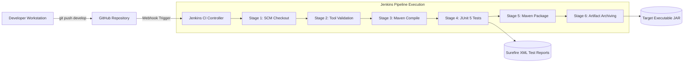

# Week 7: Jenkins CI Setup and Pipeline Baseline

**Project Title:** Jenkins-Based Food Delivery Partner Portal  
**Document Version:** 1.0.0  
**Status:** Approved Baseline  

---

## 1. Overview & CI Philosophy

Continuous Integration (CI) is a core software engineering practice where developers frequently merge code into a central repository, triggering automated compilation, static analysis, and test suites.

In the **Food Delivery Partner Portal**, the Jenkins CI pipeline ensures:
1. Every commit pushed to `develop` or pull request opened against `main` is validated automatically.
2. Breaking schema changes, broken tests, or compilation errors immediately fail the build before reaching staging.
3. Production JAR artifacts are fingerprinted, versioned, and securely archived for deployment stages.

---

## 2. Jenkins Architecture & Components



---

## 3. Jenkins Installation & Local Setup

### Option A: Using Docker Compose (Recommended)
A ready-to-run containerized Jenkins setup is provided in `docker-compose.jenkins.yml`:

```bash
# Start Jenkins in the background
docker compose -f docker-compose.jenkins.yml up -d

# View initial administrator password
docker exec -it partner-portal-jenkins cat /var/jenkins_home/secrets/initialAdminPassword
```
Access the Jenkins UI at: `http://localhost:8081`

### Option B: Native Host Installation
1. Install OpenJDK 17 or 21 LTS (`java -version`).
2. Download the Jenkins generic LTS WAR or install via package manager.
3. Start Jenkins:
   ```bash
   java -jar jenkins.war --httpPort=8081
   ```

---

## 4. Required Jenkins Plugins

Install the following recommended plugins from **Manage Jenkins $\to$ Plugins**:
* **Pipeline (workflow-aggregator):** Enables Declarative and Scripted Pipelines.
* **Git Plugin:** Integrates Git SCM checkouts and branch discovery.
* **GitHub Integration Plugin:** Automates webhook triggers on `git push`.
* **JUnit Plugin:** Publishes test execution reports (`target/surefire-reports/*.xml`).
* **HTML Publisher Plugin:** Visualizes test coverage reports.
* **Timestamper:** Appends human-readable timestamps to console outputs.

---

## 5. Global Tool Configuration

Navigate to **Manage Jenkins $\to$ Global Tool Configuration**:
1. **JDK Installation:**
   * Name: `JDK-17`
   * JAVA_HOME: Path to OpenJDK 17 (`/usr/lib/jvm/java-17-openjdk` or `C:\Program Files\Java\jdk-17`)
2. **Maven Installation:**
   * Name: `Maven-3.9`
   * Install automatically or point to existing Maven directory.

---

## 6. Pipeline Configuration & Webhook Triggers

1. In Jenkins, create a **New Item** $\to$ Select **Pipeline** $\to$ Name: `food-delivery-partner-portal-ci`.
2. Under **Build Triggers**, select **GitHub hook trigger for GITScm polling**.
3. Under **Pipeline**, select **Pipeline script from SCM**:
   * SCM: `Git`
   * Repository URL: `https://github.com/Yashparmar1125/Food-Delivery-Partner-Devops.git`
   * Branch Specifier: `*/develop` (and `*/main`)
   * Script Path: `Jenkinsfile`
4. In your GitHub repository settings, go to **Webhooks $\to$ Add Webhook**:
   * Payload URL: `http://<YOUR_JENKINS_PUBLIC_IP_OR_TUNNEL>:8081/github-webhook/`
   * Content type: `application/json`
   * Trigger: `Just the push event`

---

## 7. Pipeline Stages Walkthrough

1. **SCM Checkout:** Clones the exact commit sha from GitHub with shallow depth.
2. **Tool Validation:** Validates `java -version`, `mvn -version`, and `git --version` ensuring tool paths are correct.
3. **Compile:** Runs `mvn clean compile -DskipTests` to enforce strict compiler checks.
4. **Unit & Slice Testing:** Runs `mvn test` verifying domain state machines, repository queries, and REST endpoints.
5. **Surefire Report Archiving:** JUnit plugin parses test results and visualizes failure trends.
6. **Package:** Runs `mvn package -DskipTests` building the standalone executable JAR `target/partner-portal-1.0.0-SNAPSHOT.jar`.
7. **Archive Artifacts:** Saves the generated JAR file into the Jenkins immutable build artifact repository.
