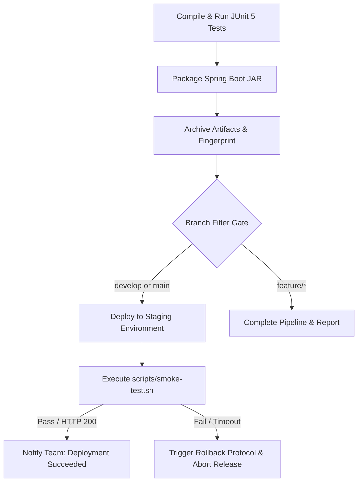

# Week 8: Jenkins Advanced Pipeline, Deployment Gates & Automated Smoke Testing

**Project Title:** Jenkins-Based Food Delivery Partner Portal  
**Document Version:** 1.0.0  
**Status:** Approved Baseline  

---

## 1. Overview & Continuous Delivery Architecture

Week 8 expands the baseline CI pipeline into a robust **Continuous Delivery (CD)** workflow. In addition to compilation and automated testing, the pipeline automatically packages the verified JAR artifact, triggers staging deployment gates, executes health smoke probes, and alerts on deployment regressions.



---

## 2. Deployment Stages Walkthrough

### 2.1 Artifact Packaging & Immutable Archiving
* The application is packaged with `mvn package -DskipTests`.
* The resulting `target/partner-portal-1.0.0-SNAPSHOT.jar` is archived using Jenkins `archiveArtifacts` with cryptographic fingerprinting. This creates an auditable record tracing the exact source commit to the binary artifact.

### 2.2 Staging Deployment Gate
* Conditioned via Declarative `when { anyOf { branch 'develop'; branch 'main' } }` rules, ensuring temporary feature branches do not overwrite shared staging servers.
* Executes deployment scripts to spin up the updated service.

### 2.3 Automated Smoke Testing Gate
* Runs `scripts/smoke-test.sh` (or `scripts/smoke-test.ps1` on Windows hosts) against the deployment target URL (`http://localhost:8080`).
* Probes three critical endpoints:
  1. `/actuator/health` $\to$ Verifies database connectivity and application status (`UP`).
  2. `/api/v1/health` $\to$ Verifies REST layer routing and application metadata.
  3. `/api-docs` $\to$ Verifies OpenAPI specification generation and swagger endpoint readiness.
* If any probe fails after 15 consecutive retry attempts, the script exits with non-zero status code `1`, causing Jenkins to immediately flag the build as `FAILURE`.

---

## 3. Rollback & Recovery Strategy

When a smoke test or deployment gate fails:
1. **Immediate Failure Halting:** Jenkins terminates downstream release steps immediately.
2. **Alerting:** Post-build failure blocks send alerts to developers with the build log URL and failing endpoint trace.
3. **Automated Rollback (Ansible Preview - Weeks 13–14):** In upcoming Week 13–14 Ansible automation, the previous healthy fingerprinted artifact will automatically be swapped back into service without manual intervention.

---

## 4. Local Execution of Smoke Test Scripts

To verify a running portal instance locally:

**On Windows (PowerShell):**
```powershell
.\scripts\smoke-test.ps1 -TargetHost "http://localhost:8080"
```

**On Linux / macOS / Docker / Jenkins:**
```bash
chmod +x scripts/smoke-test.sh
./scripts/smoke-test.sh "http://localhost:8080"
```
