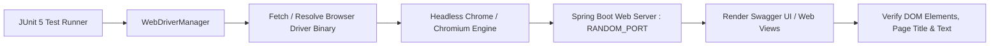

# Week 9: Selenium Automated End-to-End Testing

**Project Title:** Jenkins-Based Food Delivery Partner Portal  
**Document Version:** 1.0.0  
**Status:** Approved Baseline  

---

## 1. Overview & Test Automation Philosophy

End-to-End (E2E) testing validates that integrated systems—including HTTP network transport, security filter chains, Spring Web controllers, template/static UI engines, and documentation renderers—function correctly from the end user's perspective.

In Week 9, the **Selenium WebDriver** framework is integrated alongside **WebDriverManager** to execute automated headless browser test scenarios on both developer machines and headless CI servers.



---

## 2. Architecture & Components

* **Selenium WebDriver (`selenium-java:4.18.1`):** Industry standard client library communicating with browser drivers via the W3C WebDriver specification.
* **BoniGarcia WebDriverManager (`webdrivermanager:5.7.0`):** Automatically detects installed browser versions (Chrome, Edge, Firefox) and downloads/caches matching driver binaries without manual PATH configuration.
* **Spring Boot Random Port (`WebEnvironment.RANDOM_PORT`):** Starts embedded Tomcat on a dynamically allocated OS port, preventing port collisions during parallel builds.
* **Headless Execution Flags:**
  * `--headless=new` $\to$ Modern lightweight headless rendering engine.
  * `--no-sandbox` $\to$ Disables OS sandboxing required inside Linux Docker / Jenkins agent containers.
  * `--disable-dev-shm-usage` $\to$ Prevents shared memory exhaustion on resource-constrained containers.
  * `--remote-allow-origins=*` $\to$ Prevents cross-origin browser blocking.

---

## 3. Implemented Test Scenarios

### Scenario 1: Interactive Swagger UI Page Load
* **Class:** `com.project.partnerportal.e2e.SwaggerUiE2ETest`
* **Method:** `testSwaggerUiLoads()`
* **Validation:**
  * Browser navigates to `/swagger-ui/index.html`.
  * Waits for DOM rendering (`By.tagName("body")`).
  * Asserts page title and source contains Swagger UI and OpenAPI specifications.

### Scenario 2: Browser-Rendered Health Probe Verification
* **Class:** `com.project.partnerportal.e2e.SwaggerUiE2ETest`
* **Method:** `testHealthEndpointBrowserAccess()`
* **Validation:**
  * Browser navigates directly to `/api/v1/health`.
  * Extracts body innerText.
  * Asserts JSON payload contains `"status":"UP"` and application name `"Jenkins-Based Food Delivery Partner Portal"`.

---

## 4. Running Selenium Tests Locally

Run the E2E test suite via Maven:

```bash
mvn test -Dtest=SwaggerUiE2ETest
```

To run all project tests including E2E:
```bash
mvn test
```
