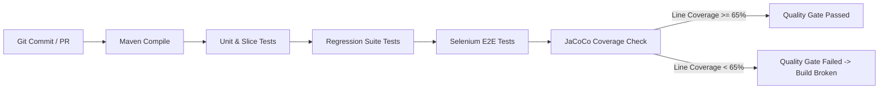

# Week 10: Continuous Testing, JaCoCo Coverage Gates & Regression Suite

**Project Title:** Jenkins-Based Food Delivery Partner Portal  
**Document Version:** 1.0.0  
**Status:** Approved Baseline  

---

## 1. Overview & Continuous Testing Strategy

Continuous testing is the automated execution of automated tests as part of the software delivery pipeline to obtain immediate feedback on business risks associated with a software release candidate.

Week 10 establishes automated quality gates combining:
1. **Unit & Slice Tests:** Fast, isolated unit and Mockito slice tests.
2. **End-to-End Browser Tests:** Headless Selenium WebDriver tests verifying interactive UI and documentation renderers.
3. **Regression Test Suite:** Exhaustive edge case, state transition boundary, and concurrency safety verification.
4. **JaCoCo Code Coverage Enforcement:** Automated code coverage metrics calculation and build-breaking quality threshold enforcement.



---

## 2. JaCoCo Quality Gate Configuration

Configured inside `pom.xml`:
* **Plugin:** `org.jacoco:jacoco-maven-plugin:0.8.11`
* **Agent Preparation:** Dynamically instruments bytecode during test execution.
* **Coverage Report Generation:** Generates interactive visual HTML report at `target/site/jacoco/index.html`.
* **Coverage Rule Threshold:** Enforces a minimum line coverage check (`COVEREDRATIO >= 0.65`) across business services, controllers, and domain logic.
* **Exclusions:** DTO data holders and boilerplate configurations are excluded to ensure metrics measure actionable business logic.

---

## 3. Regression Test Coverage Matrix

| Test Scenario | Test Class | Coverage Area | Key Verification |
|---|---|---|---|
| **Complete Lifecycle Chain** | `RegressionSuiteTest` | Full State Machine | Verifies sequential transition: `PENDING` $\to$ `VERIFICATION` $\to$ `ACTIVE` $\to$ `SUSPENDED` $\to$ `ACTIVE` $\to$ `DEACTIVATED`. |
| **Illegal Transition Rejection** | `RegressionSuiteTest` | State Boundary Security | Verifies immediate rejection of illegal jumps (`PENDING` $\to$ `DEACTIVATED`, `PENDING` $\to$ `ACTIVE`). |
| **Duplicate Vehicle Registration** | `RegressionSuiteTest` | Uniqueness Constraints | Verifies that two distinct partners cannot register the same vehicle number. |
| **Multi-Criteria Search** | `RegressionSuiteTest` | Search Engine | Verifies compound filtering by partial name, phone prefix, status, and vehicle type. |
| **Audit Trail Chronology** | `RegressionSuiteTest` | Audit & Compliance | Asserts that every state mutation appends an immutable `StatusHistory` and `AuditLog` entry. |
| **Swagger UI Interactivity** | `SwaggerUiE2ETest` | Selenium UI E2E | Verifies Swagger interactive documentation renders and displays all Partner endpoints. |
| **Health Probe Browser Verification** | `SwaggerUiE2ETest` | Web Layer E2E | Verifies JSON response payload through headless Chromium browser. |

---

## 4. Running the Quality Gate Locally

To run the complete test suite and generate the JaCoCo coverage report:

```bash
mvn clean test jacoco:report
```

To enforce the quality gate check:
```bash
mvn jacoco:check
```

To view the generated coverage report:
* Open `target/site/jacoco/index.html` in any web browser.
