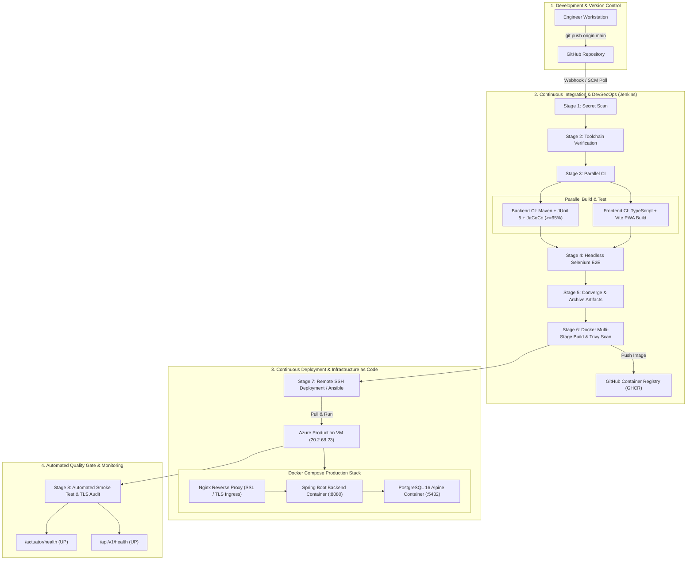

# Food Delivery Partner Portal: DevOps Engineering & Tooling Manual

**Project Title:** Enterprise Food Delivery Partner Portal & Fleet Management Platform  
**System Architecture:** Cloud-Native Spring Boot 3 + PostgreSQL 16 + React 19 PWA  
**Document Classification:** Master DevOps & Infrastructure Engineering Manual  

---

## 1. Executive DevOps Overview

The **Food Delivery Partner Portal** employs an automated, immutable, and defense-in-depth DevOps architecture designed to achieve high release velocity, guaranteed reproducible builds, and operational resilience.

Every code commit triggers an automated pipeline spanning static code analysis, supply-chain dependency audits, parallel continuous integration, browser-based end-to-end testing, containerized packaging, automated security scanning, and remote zero-downtime deployment.

---

## 2. Comprehensive Toolchain Matrix

| Category | Tool | Purpose in Project | Key Configuration / Artifact |
| :--- | :--- | :--- | :--- |
| **CI/CD Automation** | **Jenkins LTS** | Central pipeline orchestrator running multi-stage declarative pipelines | `Jenkinsfile`, `docker-compose.jenkins.yml` |
| **Configuration Mgmt** | **Ansible** | Declarative host configuration, Docker provisioning, app deployment & rollback | `ansible/playbooks/`, `ansible/inventory/hosts.ini` |
| **Containerization** | **Docker** | Multi-stage, reproducible, unprivileged container runtime | `Dockerfile`, `.dockerignore` |
| **Orchestration** | **Docker Compose** | Multi-container micro-topology with healthchecks and network isolation | `docker-compose.yml`, `.env` |
| **Unit & Slice Tests** | **JUnit 5 & Mockito** | Automated unit tests, state boundary assertions, and mock API tests | `src/test/java/**`, `RegressionSuiteTest.java` |
| **Code Coverage Gate** | **JaCoCo** | Bytecode instrumentation calculating line coverage threshold (`>= 65%`) | `target/site/jacoco/`, `pom.xml` |
| **E2E Browser Testing** | **Selenium WebDriver** | Headless browser integration testing verifying UI DOM and Swagger docs | `com.project.partnerportal.e2e.*` |
| **Smoke Testing** | **Bash / PowerShell** | Post-deployment HTTP probing and health evaluation with exponential backoff | `scripts/smoke-test.sh`, `scripts/smoke-test.ps1` |
| **Vulnerability Scanning** | **Aqua Security Trivy** | Shift-left DevSecOps scanning for filesystem dependencies and container CVEs | Integrated in `Jenkinsfile` Stages 3 & 6 |
| **Container Registry** | **GHCR** | Secure, versioned, OCI-compliant image distribution repository | `ghcr.io/yashparmar1125/food-delivery-partner-portal` |
| **Build System (Backend)** | **Apache Maven** | Dependency management, compilation, test execution, and JAR packaging | `pom.xml` |
| **Build System (Frontend)** | **Vite & TypeScript** | Strict static typechecking, tree-shaking, and PWA Service Worker caching | `frontend/vite.config.ts`, `frontend/tsconfig.json` |
| **Web Ingress & SSL** | **Nginx & Let's Encrypt** | Edge reverse proxy, HTTP-to-HTTPS redirect, HSTS, and SSL certificates | `/etc/nginx/sites-available/*` |
| **Cloud Hosting** | **Microsoft Azure VM** | Linux Ubuntu LTS host executing the production containers | Standard B2s instance (`20.2.68.23`) |

---

## 3. Tool Navigation & Detailed Guides

To explore deep architectural specifications, step-by-step implementations, and runbooks for each tool, refer to the dedicated chapters:

1. [**Ansible Infrastructure as Code & Deployment Automation**](./devops/01-ansible-automation.md)
   * *Architecture, inventory, playbooks (`provision-host.yml`, `deploy-app.yml`, `rollback-app.yml`), idempotency, and CIS host hardening.*
2. [**Jenkins CI/CD Pipeline & Complete 8-Stage Deep Dive**](./devops/02-jenkins-pipeline-deep-dive.md)
   * *Pipeline architecture, agent configuration, secrets management, and thorough breakdown of all 8 pipeline execution stages.*
3. [**Automated Testing Strategy & Quality Gates**](./devops/03-testing-strategy-and-quality-gates.md)
   * *The testing pyramid: JUnit 5 unit tests, Mockito slice tests, JaCoCo coverage enforcement, headless Selenium E2E, and automated smoke testing.*
4. [**Docker Containerization & Multi-Container Orchestration**](./devops/04-docker-and-orchestration.md)
   * *Multi-stage `Dockerfile` mechanics, unprivileged execution (`appuser`), JVM container ergonomics, and `docker-compose.yml` service orchestration.*
5. [**Supplementary DevOps Tooling Deep Dive**](./devops/05-supplementary-devops-tools.md)
   * *Aqua Trivy security audits, GitHub Container Registry (GHCR), Vite PWA frontend toolchain, and Nginx reverse proxy with automated Let's Encrypt TLS.*
