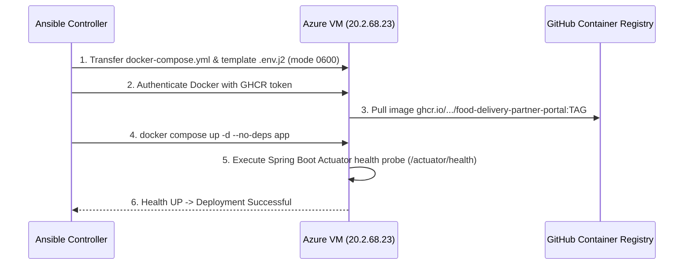

# Chapter 1: Ansible Infrastructure as Code & Deployment Automation

**Project:** Food Delivery Partner Portal & Fleet Management Platform  
**Component:** Automated Configuration Management & CD Orchestration  

---

## 1. Executive Summary & Purpose

In modern cloud engineering, manual host configuration ("snowflake servers") causes configuration drift, unpredictable runtime environments, and deployment failures.

**Ansible** is an open-source, agentless **Infrastructure as Code (IaC)** and configuration management tool. It orchestrates cloud environments over secure SSH protocols using declarative YAML playbooks.

In the **Food Delivery Partner Portal**, Ansible fulfills three critical engineering requirements:
1. **Host Hardening & Engine Provisioning:** Prepares bare Linux Ubuntu virtual machines with Docker CE, containerd, firewall rules, and privileged system parameters.
2. **Deterministic Application Deployment:** Pulls versioned OCI container images from GitHub Container Registry (GHCR), injects environment secrets via Jinja2 templates (`.env.j2`), and converges the multi-container stack.
3. **Instant Automated Rollback:** Reverts application containers to previous known-good image digests within seconds if health probes or smoke tests fail.

---

## 2. Architectural Comparison: Why Ansible?

| Capability | Ansible | Terraform | Chef / Puppet | Bash Scripts |
| :--- | :--- | :--- | :--- | :--- |
| **Agent Requirement** | **Agentless** (Uses native OpenSSH) | Agentless (Cloud APIs) | Heavy agent daemon required on each VM | Agentless |
| **Execution Paradigm** | **Idempotent** & State-Convergent | Declarative State | Declarative / Ruby DSL | Imperative (prone to error on re-run) |
| **Primary Domain** | **Configuration Management & App Deployment** | Cloud Resource Provisioning (VPCs, VMs) | Enterprise Configuration Management | Ad-hoc Task Automation |
| **Configuration Syntax** | Human-readable **YAML** | HashiCorp HCL | Ruby code | Shell scripts |
| **Secret Management** | Native `ansible-vault` & template filtering | State file encryption | Encrypted data bags | Manual / Plaintext risk |

Ansible was chosen because our infrastructure requires zero agent overhead on our Azure Linux host while delivering guaranteed **idempotent** operations (running the playbook 10 times results in the exact same state without unintended side effects).

---

## 3. Directory Layout & Modular Roles

The Ansible automation suite is organized under `ansible/` following standard enterprise role architecture:

```
ansible/
├── ansible.cfg                          # Connection, timeout, and privilege defaults
├── inventory/
│   ├── hosts.ini                        # Target host definitions & group assignments
│   └── group_vars/
│       ├── all.yml                      # Global defaults (app paths, container ports, versions)
│       └── staging.yml                  # Staging environment overrides
├── roles/
│   ├── docker_host/                     # Role 1: Docker Engine provisioning & hardening
│   │   ├── tasks/main.yml
│   │   └── handlers/main.yml
│   └── app_provisioning/                # Role 2: User creation, filesystem, and .env injection
│       ├── tasks/main.yml
│       └── templates/.env.j2
└── playbooks/
    ├── provision-host.yml               # Complete VM baseline preparation
    ├── deploy-app.yml                   # Containerized zero-downtime deployment
    └── rollback-app.yml                 # Rapid fallback to prior release
```

---

## 4. Playbook Deep Dive

### 4.1 Host Provisioning Playbook (`playbooks/provision-host.yml`)
**Purpose:** Prepares a freshly initialized Ubuntu Linux virtual machine for running enterprise container workloads.

**Key Operations Executed:**
1. **Apt Cache & Core Prerequisites:** Installs `ca-certificates`, `curl`, `gnupg`, `lsb-release`, and `python3-pip`.
2. **Official Docker GPG Keyring:** Configures the official Docker repository keyring at `/etc/apt/keyrings/docker.gpg` with verification.
3. **Docker CE & Compose Plugin:** Installs `docker-ce`, `docker-ce-cli`, `containerd.io`, and `docker-compose-plugin`.
4. **Daemon Hardening (`/etc/docker/daemon.json`):**
   * Configures `json-file` log rotation (maximum 3 files of 20MB each) to prevent disk space exhaustion.
   * Enables live restore so containers remain running during Docker daemon restarts.
5. **System User Creation:** Creates an unprivileged system user `partnerapp` (UID `10001`, GID `10001`) and assigns it to the `docker` group.
6. **Filesystem Provisioning:** Creates `/opt/food-delivery-partner` with strict `0750` permissions.

### 4.2 Application Deployment Playbook (`playbooks/deploy-app.yml`)
**Purpose:** Orchestrates the deployment of a new application build.

**Execution Flow:**


**Key Tasks:**
* **Jinja2 Secret Templating:** Dynamically renders `.env` from `.env.j2` using vault-secured variables (database credentials, JWT secret key). Permissions are locked to `0600` owned by `partnerapp`.
* **Zero-Downtime Container Recreation:** Uses `docker compose up -d --no-deps app` to recreate only the application container while keeping the `postgres` database container and network connections uninterrupted.
* **Wait-For-Health Loop:** Polling task verifies `http://localhost:8080/actuator/health` returns HTTP 200 with status `UP` within 60 seconds.

### 4.3 Automated Rollback Playbook (`playbooks/rollback-app.yml`)
**Purpose:** Triggered automatically or manually when a new release fails smoke tests.

**Execution Flow:**
1. Reads the previous known-good tag from the deployment backup pointer (`/opt/food-delivery-partner/.last_successful_tag`).
2. Updates `.env` to point `IMAGE_TAG` to the previous tag.
3. Executes `docker compose up -d --no-deps app`.
4. Verifies the rolled-back container returns to `UP` state and notifies the operations team.

---

## 5. Security Hardening & Idempotency Best Practices

* **Least Privilege Principle:** Playbook tasks execute unprivileged container operations under `partnerapp`. `become: true` is strictly restricted to kernel/package manager tasks.
* **Secret Masking:** Sensitive tasks use `no_log: true` in playbooks to prevent database passwords and JWT secrets from leaking into CI terminal logs.
* **Host Key Verification:** Uses `StrictHostKeyChecking=accept-new` with explicit OpenSSH key authentication, prohibiting password-based root SSH access.
