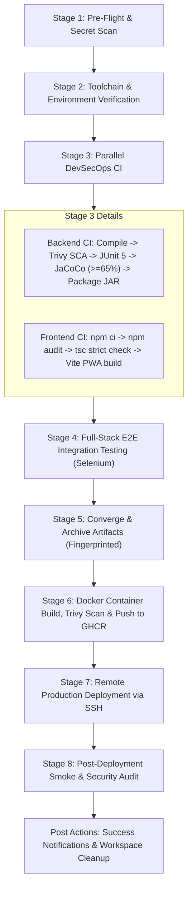

# Chapter 2: Jenkins CI/CD Pipeline & Complete 8-Stage Deep Dive

**Project:** Food Delivery Partner Portal & Fleet Management Platform  
**Component:** Continuous Integration & Delivery Pipeline (`Jenkinsfile`)  

---

## 1. Executive Summary & Purpose

**Jenkins** serves as the central CI/CD automation orchestrator for the **Food Delivery Partner Portal**. It bridges source code written by developers with automated DevSecOps validation and automated cloud deployments.

Every commit pushed to the Git repository triggers the pipeline defined in the repository root [Jenkinsfile](../../Jenkinsfile). The pipeline enforces a strict **"Build Once, Verify Everywhere, Deploy Deterministically"** philosophy.

---

## 2. Jenkins Deployment Topology

In our ecosystem, Jenkins runs as a containerized service managed via `docker-compose.jenkins.yml`:

```
┌────────────────────────────────────────────────────────┐
│                   JENKINS CONTROLLER                   │
│  Image: jenkins/jenkins:lts-jdk21                      │
│  Port: 8080 (UI / Webhooks) | 50000 (JNLP Agents)      │
│  ├── Ingress: https://jenkins.dpa.yashparmar.in        │
│  ├── Persistent Volume: jenkins_home                   │
│  └── Docker Socket Mount: /var/run/docker.sock         │
└───────────────────────────┬────────────────────────────┘
                            │ Spawns Build Toolchains
                            ▼
┌────────────────────────────────────────────────────────┐
│               PIPELINE RUNTIME CAPABILITIES            │
│  ├── JDK 21 LTS (Eclipse Temurin)                      │
│  ├── Apache Maven 3.9.x                                │
│  ├── Node.js 20.x & npm 10.x                           │
│  ├── Headless Chromium & Chromedriver                  │
│  └── Docker CLI & Trivy Vulnerability Scanner          │
└────────────────────────────────────────────────────────┘
```

---

## 3. Detailed Breakdown of All 8 Pipeline Stages

Below is an exhaustive, technical analysis of each stage defined inside the project `Jenkinsfile`:



---

### Stage 1: Pre-Flight & Secret Scan
* **Stage Name:** `Stage 1: Pre-Flight & Secret Scan`
* **Purpose:** Acts as an immediate security firewall at the threshold of the pipeline to prevent hardcoded credentials or API keys from ever being exposed or built.
* **Technical Implementation:**
  * Executes a recursive regular-expression search across the codebase using `grep -rnE`.
  * Excludes non-source build directories (`.git`, `node_modules`, `target`, `dist`).
  * Scans for patterns indicating:
    1. Unencrypted private keys (`BEGIN PRIVATE KEY`)
    2. Cloud provider keys (`aws_secret_access_key`)
    3. GitHub Personal Access Tokens (`ghp_[a-zA-Z0-9]{36}`)
* **Failure Condition:** If any unencrypted credential pattern is matched, the stage exits with status `1`, aborting the pipeline before executing any subsequent tasks.

---

### Stage 2: Toolchain & Environment Verification
* **Stage Name:** `Stage 2: Toolchain & Environment Verification`
* **Purpose:** Validates that the executing Jenkins node has all required compilation, testing, and containerization toolchains installed and properly exposed on `$PATH`.
* **Technical Implementation:**
  * Inspects Java compiler version (`java -version`).
  * Inspects Apache Maven version (`mvn -version`).
  * Validates Node.js and npm versions (`node -v && npm -v`).
  * Confirms the presence of a Chromium headless browser binary (`chromium --version` / `google-chrome --version`).
  * Queries the Docker daemon socket (`docker version --format '{{.Server.Version}}'`).
* **Value:** Prevents cryptic build errors downstream caused by mismatched compiler versions or missing binaries.

---

### Stage 3: Parallel DevSecOps CI (Backend & Frontend)
* **Stage Name:** `Stage 3: Parallel DevSecOps CI (Backend & Frontend)`
* **Purpose:** Drastically reduces build times by executing backend Java tasks and frontend React TypeScript tasks simultaneously in parallel threads.

#### Thread A: Backend CI & Quality Gate
1. **Backend Compile:** Executes `mvn clean compile -DskipTests` to parse and compile 50+ Java source files into class files.
2. **Dependency SCA & SAST (Trivy):**
   * Executes Aqua Security's Trivy scanner against `pom.xml` (`aquasec/trivy fs /workspace/pom.xml --severity HIGH,CRITICAL --scanners vuln`).
   * Detects known CVEs in third-party libraries (Spring, Jackson, PostgreSQL driver, etc.).
3. **Unit & Slice Testing:**
   * Executes JUnit 5 unit and Mockito slice tests (`mvn test -Dtest="!*E2ETest*,!*IntegrationTest*"`).
   * Generates standard JUnit XML test execution reports in `target/surefire-reports/`.
4. **JaCoCo Quality Gate:**
   * Executes `mvn jacoco:report jacoco:check`.
   * Evaluates line coverage across services and controllers against a strict **65% minimum threshold** (`COVEREDRATIO >= 0.65`).
   * Archives interactive HTML coverage reports to `target/site/jacoco/**`.
5. **Package JAR Artifact:**
   * Packages the production Spring Boot executable JAR (`mvn package -DskipTests`) into `target/partner-portal.jar`.

#### Thread B: Frontend CI & PWA Build
1. **Install Dependencies:** Executes deterministic package installation (`npm ci --prefer-offline`) from `package-lock.json`.
2. **Frontend SCA Audit:** Runs `npm audit --audit-level=critical` to ensure frontend npm dependencies contain no critical known CVEs.
3. **TypeScript Strict Typecheck:** Executes `npx tsc --noEmit` to verify type integrity, interface contracts, and component prop constraints without generating build files.
4. **Production PWA Build:** Executes `npm run build`, triggering Vite to produce optimized, minified bundles and Workbox Service Worker assets in `frontend/dist`.

---

### Stage 4: Full-Stack E2E Integration Testing
* **Stage Name:** `Stage 4: Full-Stack E2E Integration Testing`
* **Purpose:** Validates the integration between the compiled React PWA and the Spring Boot REST API from an actual end-user browser perspective.
* **Technical Implementation:**
  1. Starts a background Vite preview server serving the production build (`npx vite preview --port 4173 &`).
  2. Polls `http://localhost:4173` using `curl` until the server responds with HTTP 200.
  3. Executes headless Selenium WebDriver suites:
     * `SwaggerUiE2ETest`: Launches headless Chromium, navigates to `/swagger-ui/index.html`, and verifies interactive OpenAPI documentation renders correctly.
     * `FullStackIntegrationTest`: Simulates real browser interactions against the running application.
  4. Automatically terminates the background Vite server process (`kill -9 $VITE_PID`).
  5. Publishes all Surefire XML test results to the Jenkins test trend graph.

---

### Stage 5: Converge & Archive Artifacts
* **Stage Name:** `Stage 5: Converge & Archive Artifacts`
* **Purpose:** Archives and fingerprints the immutable build outputs so they can be inspected, downloaded, or traced back to a specific Git commit SHA.
* **Technical Implementation:**
  * Uses Jenkins `archiveArtifacts` with `fingerprint: true`.
  * Archives:
    * `target/*.jar` (Spring Boot executable backend JAR)
    * `frontend/dist/**` (Compiled frontend SPA / PWA production assets)

---

### Stage 6: Docker Container Build, Trivy Scan & Push to GHCR
* **Stage Name:** `Stage 6: Docker Container Build, Trivy Scan & Push to GHCR`
* **Purpose:** Packages the application into an immutable OCI container image, scans the image layers for vulnerabilities, and distributes it to the central container registry.
* **Technical Implementation:**
  1. **Docker Build:** Builds the image with both build-number and latest tags:
     ```bash
     docker build -t ghcr.io/yashparmar1125/food-delivery-partner-portal:${BUILD_NUMBER} -t ghcr.io/yashparmar1125/food-delivery-partner-portal:latest .
     ```
  2. **Trivy Container Scan:** Runs `aquasec/trivy image --severity HIGH,CRITICAL` against the newly built image layers, identifying vulnerabilities in the base OS (`eclipse-temurin:21-jre-jammy`).
  3. **Registry Authentication & Push:** Authenticates securely against GitHub Container Registry using Jenkins managed credentials (`container-registry-creds`) and pushes both tags.

---

### Stage 7: Remote Production Deployment via SSH
* **Stage Name:** `Stage 7: Remote Production Deployment via SSH`
* **Purpose:** Executes automated, zero-downtime container replacement on the live Azure production virtual machine (`20.2.68.23`).
* **Technical Implementation:**
  * Connects over OpenSSH using pre-shared RSA keys (`/var/jenkins_home/.ssh/id_rsa`).
  * Authenticates Docker on the production host with GHCR credentials.
  * Navigates to `/opt/food-delivery-partner`.
  * Sets the runtime image tag: `export IMAGE_TAG=${BUILD_NUMBER}`.
  * Pulls the exact newly published image:
    ```bash
    sudo docker compose -p food-delivery-partner pull app
    ```
  * Recreates only the backend application container without restarting PostgreSQL or dropping existing network connections:
    ```bash
    sudo docker compose -p food-delivery-partner up -d --no-deps app
    ```

---

### Stage 8: Post-Deployment Smoke & Security Audit
* **Stage Name:** `Stage 8: Post-Deployment Smoke & Security Audit`
* **Purpose:** Confirms that the freshly deployed release is accepting HTTP traffic and responding with healthy payloads before declaring the build successful.
* **Technical Implementation:**
  1. Executes `scripts/smoke-test.sh` with retries and exponential backoff against `https://api.dpa.yashparmar.in`.
  2. Verifies that `/actuator/health` returns HTTP 200 and status `UP` with healthy database connection validation.
  3. Verifies that `/api/v1/health` returns status `UP`.
  4. Audits live HTTP response headers using `curl -s -I` to confirm security headers (`X-Content-Type-Options: nosniff`, `X-Frame-Options`, HSTS) are actively enforced.

---

## 4. Pipeline Post-Execution Actions

* **`success`:** Emits audit logs confirming that all quality gates, security scans, and tests passed.
* **`failure`:** Emits critical alerts indicating which quality gate or test violated release criteria.
* **`always`:** Executes `cleanWs deleteDirs: true`, ensuring temporary files, checked-out source code, and cached credentials are wiped from the Jenkins workspace to prevent disk leaks and security risks.
